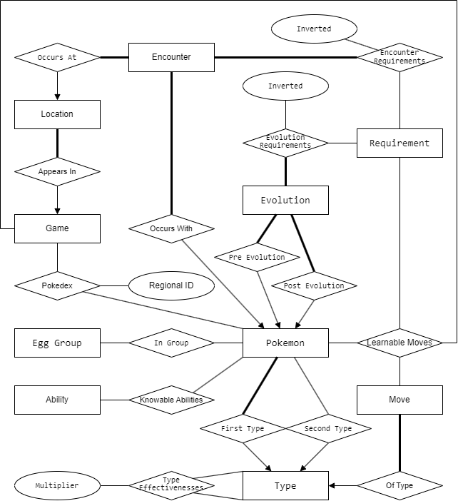
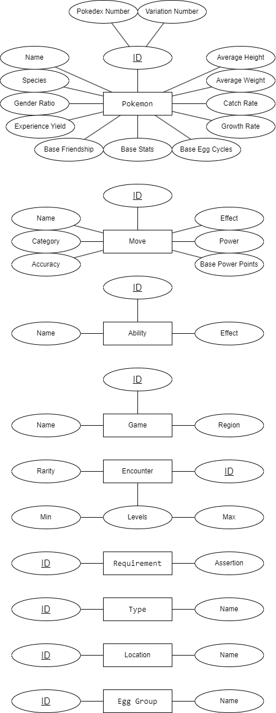

# Overview

This project focuses on performing data access operations on a large Pokémon database.

## Methods Used

- Implementing **Python scripts** to extract and display data from the database.
- Implementing **SQL views** and **PL/pgSQL functions** to support the scripts.
- Implementing a collection of **Python functions** to enhance script functionality.

# Requirements & Starting The Script

Ensure you have the following installed and set up before running the scripts:  

- **PostgreSQL** installed and running  
- **Python** installed  

### How to Set Up and Run  

1. **Start the PostgreSQL server.**  

2. **Remove any existing database and create a new one:**  

   ```sh
   # Remove an old database if it exists  
   # WARNING: This will delete all Views and Functions loaded into the database  
   dropdb --if-exists pkmon  

   # Create a new database  
   createdb pkmon  

   # Load the SQL Dump File into the database  
   psql pkmon -f pkmon.dump.sql  
   ```

   After this step, you should see a lot of output (e.g., `SET`, `CREATE`, `ALTER`, etc.).

3. **Run the helper script** to set up necessary functions and views:  

   ```sh
   psql pkmon -f helpers.sql
   ```

4. **Execute the Python scripts** to retrieve the required outputs:  

   ```sh
   python q1.py
   python q2.py
   python q4.py
   python q5.py
   ```

   The results will be printed directly in the command line.


# The Task

## Q1: Print Game Information

Prints information about the number of Pokémon and the number of locations in each Pokémon game.

Each game should be displayed on a separate line, using the following format:

```
{RegionName:<6} {GameName:<17} {#Pokemon:<8} {#Locations}
```

Add a heading at the start of the output in the following format:

```
Region Game              #Pokemon #Locations
```

---

## Q2: Print Pokémon Encounter Locations

Given the name of a Pokémon, print all distinct locations where this Pokémon can be encountered.

### Output Restrictions:
Columns must include:
- **Game Name**
- **Location Name**
- **Encounter Rate (Rarity)**
- **Minimum Encounter Level**
- **Maximum Encounter Level**
- **Encounter Requirements** (as a comma-separated list)

### Rarity Display:
- **Common**: 21% or higher
- **Uncommon**: 6% to 20%
- **Rare**: 1% to 5%
- **Limited**: 0%

### Ordering:
Results should be ordered first by the region name of each game, then by the data in the column order above.

The output should be formatted as a table, with columns dynamically aligned.

---

## Q4: Print Possible Moves in Battle

Given:
- The name of a game in the Pokémon database
- The name of a Pokémon that is attacking
- The name of a Pokémon that is defending

Print all possible moves that the attacking Pokémon can use against the defending Pokémon.

### Output Conditions:
Columns must include:
- **Move Name**
- **Effective Power** (when used against the defending Pokémon)
- **Requirements** (for the attacking Pokémon to learn the move)

### Effective Power Calculation:
1. Take the move's base power from the moves table.
2. Multiply by **1.5** (rounded down) if the move's type matches either of the attacking Pokémon’s types.
3. Multiply by the **effectiveness** of the move's type against the defending Pokémon's type(s) (rounded down).

#### Example:
If **Diglett** is attacking **Magnemite** with **Bulldoze**:
- **Bulldoze** has a base power of **60**.
- **Diglett** is a **Ground** type, which matches Bulldoze’s type → **Power × 1.5 = 90**.
- **Magnemite** is an **Electric** type, which is weak to Ground → **Power × 2 = 180**.
- **Magnemite** is also a **Steel** type, which is weak to Ground → **Power × 2 = 360**.

So, the effective power of **Bulldoze** when used by **Diglett** against **Magnemite** is **360**.

### Ordering:
- Output should be ordered first by **effective power**, then by **move name**.
- If a move can be learned by a Pokémon in multiple ways, the requirements should be ordered by **ID of the requirement**.

---

## Q5: Print Pokémon Evolution Chain

Given the name of a Pokémon, print its evolution chain.

The **evolution chain** consists of Pokémon that the given Pokémon can evolve from and evolve into.

### Example:
If **Bulbasaur** is provided as input, the script should output:
```
Bulbasaur → Ivysaur → Venusaur
```
If **Ivysaur** is given as input, the output order would be:
```
Bulbasaur ← Ivysaur → Venusaur
```

### Handling Evolution Chains:
- If a Pokémon has **no pre-evolution**, stop the backward chain.
- If a Pokémon has **an evolution**, check the next stage recursively.
- If a Pokémon has **multiple evolution paths**, print all possibilities.

### Evolution Requirements:
Each evolution has specific requirements, which may involve **AND** or **OR** conditions:
- **AND Relationship**: A Pokémon must meet multiple conditions simultaneously.
- **OR Relationship**: A Pokémon can evolve through multiple independent conditions.

### Ordering:
- Whenever there are multiple choices, print the Pokémon with the **lowest ID** first.
- When ordering requirements, print:
  - **Non-inverted** requirements before **inverted** ones.
  - **Requirements with the lowest ID** first.


# The Schema

## Tables

### Pokémon
This table describes general aspects of each Pokémon, including:
- Its unique ID (a combination of a **Pokédex number** and a **variation number**).
- Its **name**, **species**, **growth rate**, and **basic properties** (hit points, speed, etc.).

### Games
This table indicates **which region** a particular game occurs in. 
- The **game ID** is also used as part of a **Pokédex** and an **Encounter**.

### Types
- Each Pokémon has at least **one type** (e.g., Fire, Water, Ghost, Flying).
- Some Pokémon may have **two types**.
- All **Moves** also have a **type**.

### Abilities
Pokémon have a wide range of possible abilities (e.g., **Flame Body, Gooey, Iron Fist, Neuroforce**).
- A description of each ability is contained in the **effect** column of this table.
- Each ability a Pokémon knows is recorded in the **Knowable_Abilities** table.

### Moves
Pokémon have a large range of possible moves they can make (e.g., **Blizzard, Block, Bounce**).
- Each move has an associated **category, power, and accuracy**.
- Pokémon can potentially **learn more moves** during a game.
- Each move a Pokémon can learn is recorded in the **Learnable_Moves** table.

### Evolutions
Some Pokémon can **change form**, and this table describes:
- The **starting form** and **final form**.
- The **conditions** required for evolution, which are stored in the **Evolution_Requirements** table.

### Requirements
Certain changes (e.g., evolutions, encounters, learnable moves) require **pre-conditions** before they can occur.
- The **Requirements** table provides a list of possible **pre-conditions** applied to tables associated with **changes**.

### Encounters
Encounters describe:
- **Where** you might find a Pokémon under certain conditions.
- **How likely** the encounter is.
- The **level** at which the Pokémon may be encountered.

### Egg Groups
Pokémon can **breed**, but only with other Pokémon in the same **Egg Group**.

# The ER diagram

ER diagram of Pokémon relations
Attributes have been removed to make the relations more readable


ER diagram of Pokémon attributes
Relations have been removed to make the attributes more readable


# Database Summery
After setting up the database, you can verify its contents using the `dbpop` function. This function provides an overview of the number of rows in each table.  

#### **Access the Database:**  

```sh
psql pkmon
```

#### **Run the `dbpop` Function:**  

```sql
SELECT * FROM dbpop();
```

#### **Expected Output:**  

| Table Name              |Number of Rows|
|-------------------------|--------------|
| abilities               |          297 |
| egg_groups              |           15 |
| encounter_requirements  |       44,492 |
| encounters              |       40,280 |
| evolution_requirements  |          650 |
| evolutions              |          535 |
| games                   |           39 |
| in_group                |        1,494 |
| knowable_abilities      |        2,696 |
| learnable_moves         |    1,262,002 |
| locations               |        3,542 |
| moves                   |          915 |
| pokedex                 |       11,819 |
| pokemon                 |        1,191 |
| requirements            |          830 |
| type_effectiveness      |          120 |
| types                   |           18 |
(17 rows)  

This provides a quick summary of the database and helps verify that the data has been successfully loaded.


# Final Note
This project is based on my university database coursework. The specifications, query questions, database, and visuals were provided by the course team (this spec is a simplified version of the original). My contribution includes implementing the logic for querying data in q1.py, q2.py, q4.py, and q5.py. The original data and tables were supplied by the team.